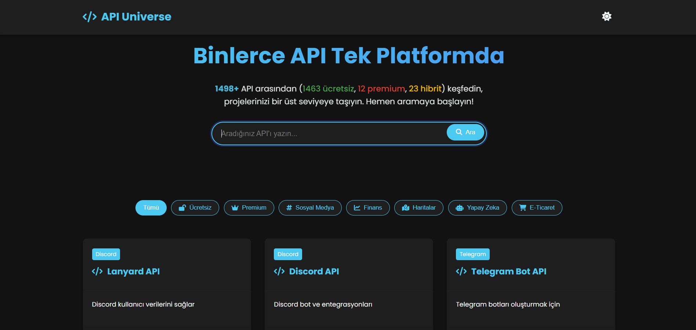

# API Universe - Proje Dokümantasyonu



## 📌 Proje Tanımı
API Universe, geliştiriciler için ücretsiz ve premium API'ları keşfedebilecekleri, kategorilere göre filtreleyebilecekleri ve projelerinde kullanabilecekleri kapsamlı bir API kütüphanesidir.

## ✨ Öne Çıkan Özellikler
- **1000+ API** içeren geniş veritabanı
- **Sonsuz scroll** ile performans optimizasyonu
- **Gerçek zamanlı arama** ve filtreleme
- **Koyu/açık tema** desteği
- **API istatistikleri** (ücretsiz/premium sayımları)
- **Responsive tasarım** (tüm cihazlarda uyumlu)

## 🛠 Kurulum

### Ön Gereksinimler
- Node.js (v14+)
- NPM/Yarn

### Adım Adım Kurulum
1. Depoyu klonlayın:
   ```bash
   git clone https://github.com/kullaniciadiniz/api-universe.git
   cd api-universe
   ```

2. Gerekli paketleri yükleyin:
   ```bash
   npm install
   ```

3. Projeyi başlatın:
   ```bash
   npm start
   ```

4. Tarayıcıda açın:
   ```
   http://localhost:3000
   ```

## 📂 Dosya Yapısı
```
api-universe/
├── index.html       # Ana HTML dosyası
├── css             # Stil dosyaları
├── js              # JavaScript dosyaları
├── api/
│   └── data.json        # API veritabanı
└── README.md            # Bu dosya
```

## 🌈 Tema Özelleştirme
Renkleri değiştirmek için `css/style.css` dosyasındaki değişkenleri güncelleyin:
```css
:root {
  --primary-color: #4361ee;
  --secondary-color: #3f37c9;
  --free-color: #4caf50;
  --paid-color: #f44336;
  --both-color: #ffc107;
}
```

## 🚀 Kullanılan Teknolojiler
- **Frontend**: HTML5, CSS3, JavaScript (ES6+)
- **Backend**: Node.js, Express
- **Veritabanı**: JSON tabanlı yerel veritabanı
- **Diğer**: Font Awesome, Google Fonts

## 📊 Veri Yapısı
API verileri `api/data.json` dosyasında şu şekilde saklanır:
```json
{
  "id": 1,
  "name": "API Adı",
  "category": "Kategori",
  "description": "Açıklama",
  "pricing": "free/paid/both",
  "link": "API URL",
  "working": true
}
```

## 🧩 Özelleştirme
### Yeni API Ekleme
1. `api/data.json` dosyasını açın
2. Yeni API objesini ekleyin:
   ```json
   {
     "id": 1001,
     "name": "Yeni API",
     "category": "Kategori",
     "description": "Açıklama",
     "pricing": "free",
     "link": "https://ornek-api.com",
     "working": true
   }
   ```

## 📜 Lisans
Bu proje MIT lisansı altında lisanslanmıştır. Daha fazla bilgi için `LICENSE` dosyasını inceleyin.

## 📞 İletişim
[](https://discord.com/users/1015356240492245054)
[](https://instagram.com/)

---

**API Universe** - Geliştiriciler için nihai API keşif platformu 🚀